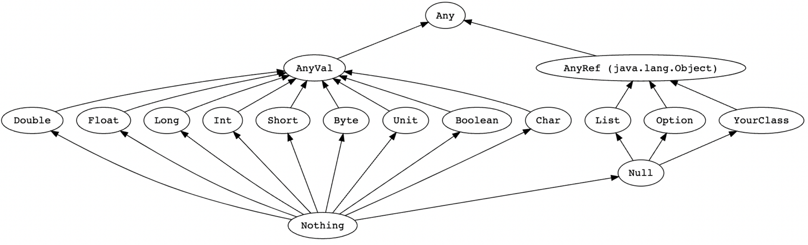

# ScalaSession
Scala Learning for beginners

1. What is Classes, Object, traits, sealed traits.
2. What is companion object. And difference between object and companion object.
3. How to do data modelling.
4. What are the operators, predef? How it is used?
5. What is difference between a var, val and def? When to use?
6. What is Extractors? Difference between apply and unapply?
7. What is Functional Programming: Immutability, Case class, for-comprehension, Variance
8. What is Pattern Match? Difference between Null, Nil, None and Nothing?
9. How to do Error Handling? What are the different ways to do?
10. Functional Combinators, recursion, tail recursion, map, flatmap, fold, reduce.
11. Difference between foldLeft, foldRight, reduceLeft, reduceRight.
12. What is Currying? What is implicit parameters?
13. What are Higher order functions?
14. Partial Function, Partially applied function
15. What is parallel and Concurrent processing? Future, Asyn, await call.

### References:
* https://www.educative.io/blog/scala-tutorial-for-java-programmers
* https://danielwestheide.com/books/the-neophytes-guide-to-scala/
* https://www.w3resource.com/scala-exercises/basic/index.php

